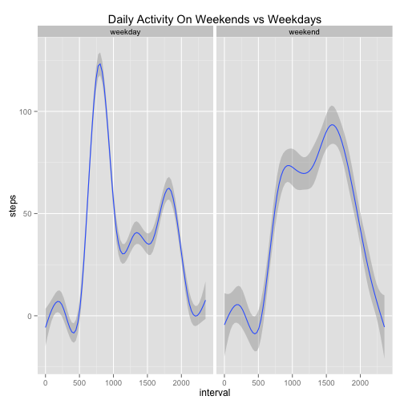

Reproducible Research: Peer Assessment 1
========================================
## Loading and preprocessing the data.  
*act* will be the name of the activity data frame.  

```r
act <- read.csv("activity.csv")
options("digits"=7)
```
What can I learn about this data?

```r
str(act)
```

```
## 'data.frame':	17568 obs. of  3 variables:
##  $ steps   : int  NA NA NA NA NA NA NA NA NA NA ...
##  $ date    : Factor w/ 61 levels "2012-10-01","2012-10-02",..: 1 1 1 1 1 1 1 1 1 1 ...
##  $ interval: int  0 5 10 15 20 25 30 35 40 45 ...
```

```r
summary(act)
```

```
##      steps                date          interval     
##  Min.   :  0.00   2012-10-01:  288   Min.   :   0.0  
##  1st Qu.:  0.00   2012-10-02:  288   1st Qu.: 588.8  
##  Median :  0.00   2012-10-03:  288   Median :1177.5  
##  Mean   : 37.38   2012-10-04:  288   Mean   :1177.5  
##  3rd Qu.: 12.00   2012-10-05:  288   3rd Qu.:1766.2  
##  Max.   :806.00   2012-10-06:  288   Max.   :2355.0  
##  NA's   :2304     (Other)   :15840
```

```r
head(act)
```

```
##   steps       date interval
## 1    NA 2012-10-01        0
## 2    NA 2012-10-01        5
## 3    NA 2012-10-01       10
## 4    NA 2012-10-01       15
## 5    NA 2012-10-01       20
## 6    NA 2012-10-01       25
```

```r
tail(act)
```

```
##       steps       date interval
## 17563    NA 2012-11-30     2330
## 17564    NA 2012-11-30     2335
## 17565    NA 2012-11-30     2340
## 17566    NA 2012-11-30     2345
## 17567    NA 2012-11-30     2350
## 17568    NA 2012-11-30     2355
```
*date* is a factor   
*interval* is an integer  
These elements may need processing in order to use date-related functions  
There are appear to be **288** daily observations, **2304** total NA's  
Various poking&|prodding leads me to conclude that the NA's are **8** whole 
days' worth of missing data.
## What is mean total number of steps taken per day?
To find the mean total number of steps per day *mtds* I can tapply() the sum() 
function of *steps* across the *date* factor; NA values must be removed  
Then create a histogram, and find the mean and median.

```r
act_nona <- act[complete.cases(act),]
mtds <- tapply(act_nona$steps,act_nona$date,sum)
hist(mtds,40,xlab="Mean Total Daily Steps")
```

 

```r
str(mtds)
```

```
##  int [1:61(1d)] NA 126 11352 12116 13294 15420 11015 NA 12811 9900 ...
##  - attr(*, "dimnames")=List of 1
##   ..$ : chr [1:61] "2012-10-01" "2012-10-02" "2012-10-03" "2012-10-04" ...
```

```r
summary(mtds)
```

```
##    Min. 1st Qu.  Median    Mean 3rd Qu.    Max.    NA's 
##      41    8841   10760   10770   13290   21190       8
```
Mean Total Daily Steps = **10770**, Median Total Daily Steps = **10760**
Hmm, **8** NA's? Thought I'd handled those. I do not understand  why, after 
removing the rows of NA values in the new data frame *act_nona*, I should have 
these NA values. Are they affecting the result?

```r
mtds<-mtds[!is.na(mtds)]
str(mtds)
```

```
##  int [1:53(1d)] 126 11352 12116 13294 15420 11015 12811 9900 10304 17382 ...
##  - attr(*, "dimnames")=List of 1
##   ..$ : chr [1:53] "2012-10-02" "2012-10-03" "2012-10-04" "2012-10-05" ...
```

```r
summary(mtds)
```

```
##    Min. 1st Qu.  Median    Mean 3rd Qu.    Max. 
##      41    8841   10760   10770   13290   21190
```
No, it appears not. It seems 61 levels of *date* were passed with the tapply 
function, so removing rows from the frame did not remove levels. Good to know.
## What is the average daily activity pattern?
Now to find the average daily activity pattern by interval *ids*.  
tapply(), this time the mean() function across the *interval* factor.  
Plotting the result. Using unique() to get the correct dimensions for the plot.
Then, calculating which time interval is the max of the daily averages.

```r
ids <- tapply(act_nona$steps,act_nona$interval,mean)
plot(unique(act_nona$interval),ids,type="l",xlab="Daily Time Interval",
     ylab="Steps Taken",main="Average Daily Activity Pattern")
```

 

```r
maxids<-which(ids==max(ids))
maxids<-ids[maxids]
maxids
```

```
##      835 
## 206.1698
```
*maxids* = **206** at the *835* interval (8:35 am)
## Imputing missing values
First, calculate the total number of missing values. Did this already, but 
here it is again

```r
howmanyna <- nrow(act)-nrow(act_nona)
howmanyna
```

```
## [1] 2304
```
Now to devise a strategy to deal with the NAs. I am not a satistician, so if 
my intuition has me astray, please do not hold it against me.  
It seems that filling the missing intervals with the daily average for that 
interval is fairly logical. It should have only a minor effect on the mean and 
a greater, but still mild, effect on the median (since there is a 
strong likelihood for introducing duplicate data). Also, having read through 
the assignment, and knowing we will be asked to compare weekday and weekend 
daily activity, it seems just slightly more logical to fill a missing day's 
interval data with the daily average for THAT day. We have 53 days observed, 
so that should be sufficient to get different interval averages by day. This 
approach should also reduce the amount of duplicate data, thereby minimizing 
its effect on the median.  
First, time to process the data to be able to take advantage of the weekdays() 
function. I'm processing the *date* and *interval* factor to convert get a 
*datetime* vector, then adding a new column *day*, then removing NAs 

```r
time <- sprintf("%04d",act$interval)
time <- sub("([[:digit:]]{2,2})$", ":\\1",time)
datetime <- paste(act$date,time)
datetime <- strptime(datetime,"%Y-%m-%d %H:%M")
act <- cbind(act,"day"=weekdays(datetime))
summary(act[which(is.na(act$steps)),])
```

```
##      steps              date        interval             day     
##  Min.   : NA    2012-10-01:288   Min.   :   0.0   Friday   :576  
##  1st Qu.: NA    2012-10-08:288   1st Qu.: 588.8   Monday   :576  
##  Median : NA    2012-11-01:288   Median :1177.5   Saturday :288  
##  Mean   :NaN    2012-11-04:288   Mean   :1177.5   Sunday   :288  
##  3rd Qu.: NA    2012-11-09:288   3rd Qu.:1766.2   Thursday :288  
##  Max.   : NA    2012-11-10:288   Max.   :2355.0   Tuesday  :  0  
##  NA's   :2304   (Other)   :576                    Wednesday:288
```
Missing **2** Fridays, **2** Mondays, **1** each Saturday, Sunday, Thursday, 
Wednesday. All the Tuesdays are intact, and so I do not need an interval 
average on that day.  
Here I'm creating per *day* *ids* values, NAs omitted.

```r
act_nona <- act[complete.cases(act),]
act_nona_Mon <- subset(act_nona,day=="Monday")
act_nona_Wed <- subset(act_nona,day=="Wednesday")
act_nona_Thu <- subset(act_nona,day=="Thursday")
act_nona_Fri <- subset(act_nona,day=="Friday")
act_nona_Sat <- subset(act_nona,day=="Saturday")
act_nona_Sun <- subset(act_nona,day=="Sunday")
ids_Mon <- tapply(act_nona_Mon$steps,act_nona_Mon$interval,mean)
ids_Wed <- tapply(act_nona_Wed$steps,act_nona_Wed$interval,mean)
ids_Thu <- tapply(act_nona_Thu$steps,act_nona_Thu$interval,mean)
ids_Fri <- tapply(act_nona_Fri$steps,act_nona_Fri$interval,mean)
ids_Sat <- tapply(act_nona_Sat$steps,act_nona_Sat$interval,mean)
ids_Sun <- tapply(act_nona_Sun$steps,act_nona_Sun$interval,mean)
```
I now have the mean interval steps for each individual day correspending to 
days with missing data. Now to write them back to a new data frame.

```r
act_new <- act
act_new$steps[1:288] <- ids_Mon
act_new$steps[2017:2304] <- ids_Mon
act_new$steps[12673:12960] <- ids_Wed
act_new$steps[8929:9216] <- ids_Thu
act_new$steps[11233:11520] <- ids_Fri
act_new$steps[17281:17568] <- ids_Fri
act_new$steps[11521:11808] <- ids_Sat
act_new$steps[9793:10080] <- ids_Sun
```
Did it work?

```r
any(is.na(act_new))
```

```
## [1] FALSE
```
How did it affect the data?

```r
tds_new <- tapply(act_new$steps,act_new$date,sum)
hist(tds_new,40,xlab="Mean Total Daily Steps")
```

 

```r
summary(tds_new)
```

```
##    Min. 1st Qu.  Median    Mean 3rd Qu.    Max. 
##      41    8918   11020   10820   12810   21190
```
New Mean = **10820** New Median = **11020**. As expected, there is a 
minor effect on Mean, and a mild, but more signifacant effect on the Median.  
The new mean is approximately 0.01% higher then when calculated by omitting 
missing data. The new median is 2.32% higher, which seems moderately 
moderately significant. Probably this is less skewed than if I had simply 
replaed NAs with mean daily intervals from all days, as there would have been 
much more duplicate data added to the frame. This is conjecture though; I did 
not test this yet.
## Are there differences in activity patterns between weekdays and weekends?
Using the day column, I will add a new factor variable to the frame. First, 
I will create a factor vector, defaulting to "weekday", and then switch over 
the days which are weekends, then plot the data.

```r
status<-rep(factor("weekday",levels=c("weekday","weekend")),17568)
for (i in 1:nrow(act_new)){
        if (act_new$day[i]=="Saturday" || act_new$day[i]=="Sunday") {
                status[i] <- "weekend"
        }
}
act_new<-cbind(act_new,status)
library(ggplot2)
qplot(interval,steps,data=act_new,geom="smooth",facets=.~status,
      main="Daily Activity On Weekends vs Weekdays")
```

```
## geom_smooth: method="auto" and size of largest group is >=1000, so using gam with formula: y ~ s(x, bs = "cs"). Use 'method = x' to change the smoothing method.
## geom_smooth: method="auto" and size of largest group is >=1000, so using gam with formula: y ~ s(x, bs = "cs"). Use 'method = x' to change the smoothing method.
```

 

```r
#
```
It seems that the activity level on the weekday picks up earlier in the day 
perhaps to go to work? The weekend activity level seems higher overall, 
and more evenly spread throughout the day. Let's get same hard data.  

```r
act_Weekday <- subset(act_new,status=="weekday")
act_Weekend <- subset(act_new,status=="weekend")
ids_Weekday <- tapply(act_Weekday$steps,act_Weekday$interval,mean)
ids_Weekend <- tapply(act_Weekend$steps,act_Weekend$interval,mean)
mean(ids_Weekday);sum(ids_Weekday)
```

```
## [1] 35.61641
```

```
## [1] 10257.53
```

```r
mean(ids_Weekend);sum(ids_Weekend)
```

```
## [1] 43.07837
```

```
## [1] 12406.57
```

```r
sum(ids_Weekend)-sum(ids_Weekday)
```

```
## [1] 2149.046
```
Confirmed. Mean Daily Interval Steps, and Total Daily Steps are both higher 
on the weekend, even though the maximum daily interval is clearly found on 
weekday mornings.
